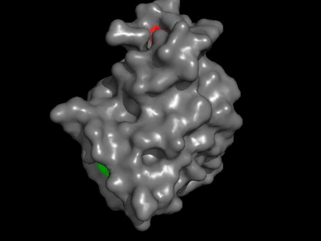

# BindRefine

This project aims to refine per residue ligand type predictions using predicted distance maps. This is achieved by clustering the residues based on the distances and subsequently removing noise and/or small clusters from the predictions. The goal
is to reduce the number of false positive while maintaining a high recall. 

To access the performace of the tool visually, the predictions and the refined predictions can be visualized in gif-format.

##Example

###Before


###After




While some TP (red) are removes, the cluster at the top stays. 

### How To

You can find example files for each input files in examples/.

Input files:

1. Uniprot IDs
2. Ligand Map (offset and Uniprot -> PDB link)
3. (optional) Trues, per residue ligand type
4. Predictions, per residue binding molecule
5. Distance maps for each protein

Refinement of binding residue predictions using known and predicted structures.

### Usage

```
usage: main.py [-h] -o OUTDIR -u UNIPROT -lm LIGANDMAP -p PREDSDIR -t TRUES
               [-th THRESHOLD] [-fps FPS] [-d DISTANCEMAP] [-v] [-s] [-r]

optional arguments:
  -h, --help            show this help message and exit
  -o OUTDIR, --outdir OUTDIR
                        Output directory for files and visualizations
  -u UNIPROT, --uniprot UNIPROT
                        Input file: List of uniprot ids to analyse
  -lm LIGANDMAP, --ligandmap LIGANDMAP
                        Input file: Ligand map
  -p PREDSDIR, --predsdir PREDSDIR
                        Directory containing predictions
  -t TRUES, --trues TRUES
                        File containing true ligand indices and types
  -th THRESHOLD, --threshold THRESHOLD
                        Threshold used for classification of predictions
  -fps FPS              fps (not really fps) of rendered gif
  -d DISTANCEMAP, --distancemap DISTANCEMAP
                        Directory containing distance maps for clustering
  -v, --verbose         Verbose boolean
  -s, --save            Saves results as csv
  -r, --render          Renders gif of protein
```